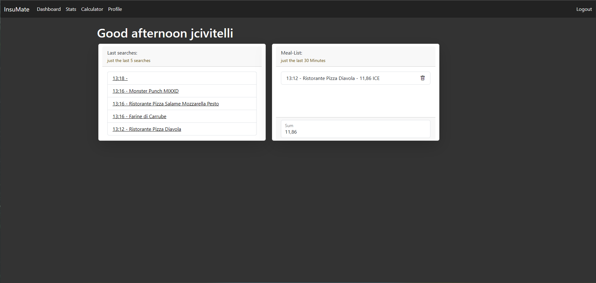
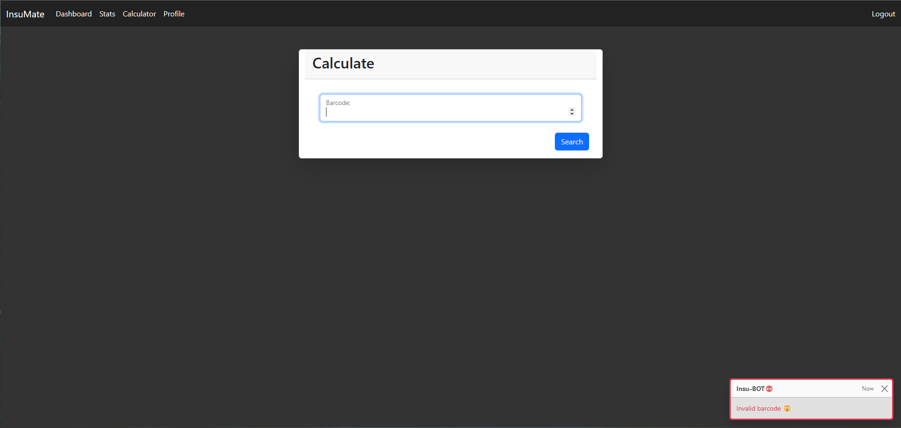
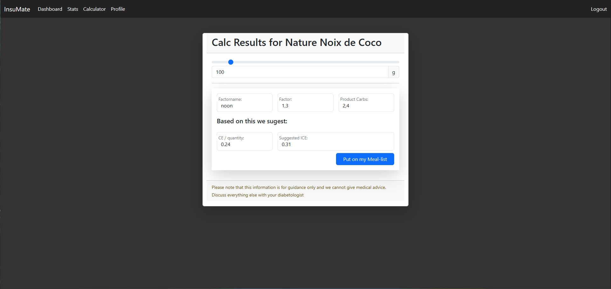
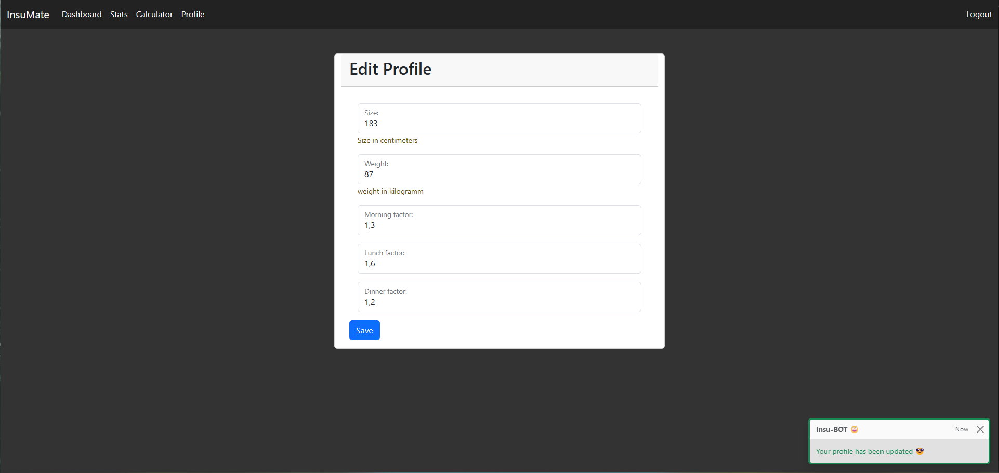
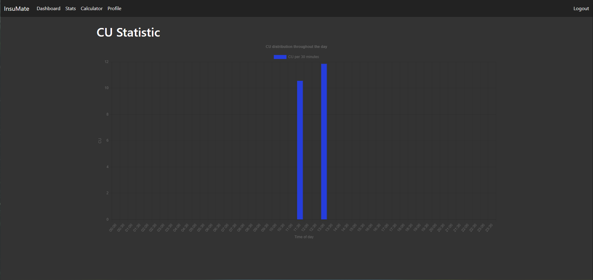

>[!NOTE]
>
> Keep in mind, work is still in progress

# InsuMate User Guide

Welcome to InsuMate, your diabetes management assistant. This guide will walk you through the main features of the application.

## Getting Started

1. Log in to your InsuMate account.
2. You'll see the main dashboard with various options at the top: Dashboard, Stats, Calculator, and Profile.

## Using the Calculator

1. Click on the "Calculator" tab in the top menu.
2. You'll see a "Calculate" screen with a "Barcode" input field.
3. Enter the barcode of your food item and click "Search".
4. If the barcode is invalid, you'll see an error message:

5. For valid barcodes, you'll see the calculation results:

6. The results show:
   - Product name
   - Quantity (in grams)
   - Factor (based on time of day)
   - Product Carbs
   - CE (Carbohydrate Equivalents) / quantity
   - Suggested ICE (Insulin Carbohydrate Equivalents)
7. Click "Put on my Meal-list" to add this item to your meal list.

## Viewing Your Dashboard

1. Click on the "Dashboard" tab to view your recent activity.
2. You'll see:
   - Your last searches
   - Your Meal-List for the last 30 minutes
   - The sum of ICE for your recent meals

## Editing Your Profile

1. Click on the "Profile" tab.
2. You can edit your:
   - Size (in centimeters)
   - Weight (in kilograms)
   - Morning factor
   - Lunch factor
   - Dinner factor
3. Click "Save" to update your profile.

## Viewing Statistics

1. Click on the "Stats" tab to view your CU (Carbohydrate Units) statistics.
2. The graph shows your CU distribution throughout the day.

> [!WARNING]
>
> Remember, this information is for guidance only. Always consult with your diabetologist for medical advice.
>
>For any issues or questions, please contact InsuMate support.
